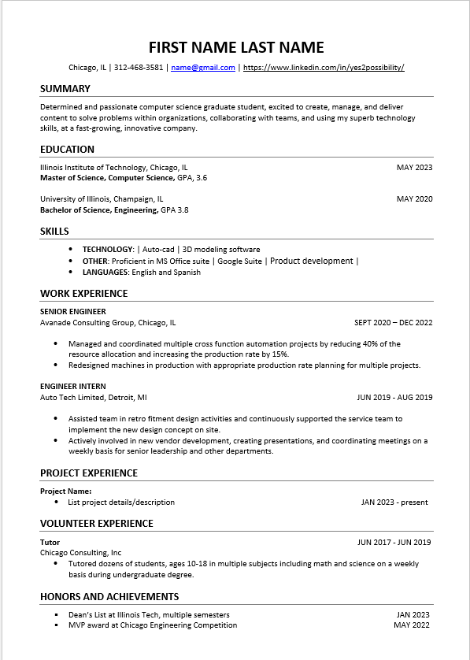

# Frontend Technical Specification

- Create a static website that serves asn html Resume.

## Resume Format Considerations

I live in Chicago, USA and dresumes in word/pdf formats are suppose toe xclude personally identifiable infomraitons like Phone Number, Sex or Address. 

I will be using the [Illinois Institute of Technology (IIT)](https://www.iit.edu/sites/default/files/2023-03/new_sample_resume_iltech_1.doc) Template format as the basis of my this resume challenge project.

### Illinois Tech Resume Format Generation

I know html quite well so I will let Gen AI do the heavy lifting to generate the HTML and possibly CSS and then on i will refactor manually the code to meet my preffered standard.

Prompt to Claude

```text
Convert this resume format into htmml

````

Image provided to Claude LLM or  use the attached [MS Word file](./docs/IIT_Resume_Format.doc)


This is the [generated output](./docs/resume_format%20-%20Nov-27-2025.html) which i will further work on as i go on

## HTML Adjustments

- UTF-8 will support most languages so keepin that.
- We'll extract our styles into its onw stylesheet after completing the html markup

## CSS Styling System

The resume uses a comprehensive, professional stylesheet built with pure CSS and CSS variables for maintainability and scalability.

### Design Philosophy

- **Professional & Elegant**: Minimalist design suitable for cybersecurity and cloud engineering roles
- **Tech-Forward**: Inspired by high-end tech resumes from Google, AWS, and consulting firms
- **Accessible**: WCAG-compliant with clear focus states and readable font sizes
- **Performance-Optimized**: No frameworks, pure CSS with efficient selectors

### CSS Design System

#### Color Palette

- **Primary Color**: Deep slate blue (`#1e3a5f`) - used for headings and accents
- **Primary Light**: Lighter variant (`#2d5a8c`) - for hover states
- **Text Dark**: `#1f2937` - main content text
- **Text Light**: `#6b7280` - secondary text and descriptions
- **Accent Teal**: `#0d9488` - subtle accents for titles and positions
- **Backgrounds**: White and light gray for clean separation

#### Typography

- **Font Family**: System fonts (-apple-system, BlinkMacSystemFont, Segoe UI, Roboto)
- **Font Sizes**: Scaling from `0.875rem` (14px) to `2rem` (32px)
- **Line Heights**: Optimized for readability (1.3 - 1.7)
- **Font Weights**: 400 (normal) to 700 (bold)

#### Spacing System

Consistent spacing scale from `0.25rem` to `3rem` for margins, padding, and gaps:
- `--spacing-xs`: 4px
- `--spacing-sm`: 8px
- `--spacing-md`: 16px
- `--spacing-lg`: 24px
- `--spacing-xl`: 32px
- `--spacing-2xl`: 48px

#### Layout Features

- **Maximum Width**: 900px container for optimal readability
- **Visual Hierarchy**: Clear section separators with subtle blue borders
- **White Space**: Generous spacing for elegant presentation
- **Section Styling**: Each section (Education, Skills, Experience, etc.) has consistent styling with clear visual separation

### CSS Organization

The stylesheet is organized into logical sections:

1. **CSS Variables** - Design system definitions
2. **Reset & Base Styles** - Normalization and defaults
3. **Typography** - Heading and text styles
4. **Links & Interactions** - Hover and focus states
5. **Layout & Container** - Core layout structure
6. **Header / Contact Section** - Name, title, and contact information
7. **Main Content** - Main resume sections
8. **Section Styling** - Individual entry styling
9. **Lists** - Bullet and numbered lists
10. **Skills Section** - Skills grid layout
11. **Certifications** - Badge and certification styling
12. **Print Styles** - Optimized for printing
13. **Responsive Design** - Mobile and tablet breakpoints
14. **Accessibility** - WCAG compliance and preference-based styles
15. **Performance** - Optimization comments

### Responsive Design

- **Desktop**: Full layout with optimal spacing
- **Tablet (768px and below)**: Adjusted spacing and font sizes
- **Mobile (480px and below)**: Optimized for small screens with single-column layout

### Accessibility Features

- **WCAG Compliance**: Proper color contrast ratios
- **Focus States**: Clear visible focus indicators for keyboard navigation
- **Readability**: Comfortable font sizes and line heights
- **Prefers-Reduced-Motion**: Respects user's motion preferences
- **High Contrast Mode**: Support for users requiring higher contrast
- **Dark Mode**: Optional dark theme based on system preference

### CSS Variables for Easy Maintenance

All colors, fonts, and spacing are defined as CSS variables at the root level, making it easy to:
- Update the color scheme globally
- Adjust spacing and sizing
- Maintain consistency throughout the design
- Support different themes (e.g., dark mode)

## Serving the Static Website Locally

To serve the frontend locally during development, you'll need to install and use `http-server`.

### Installing http-server

http-server is a simple, zero-configuration command-line HTTP server that's perfect for serving static files.

#### Prerequisites
- Node.js and npm must be installed on your system

#### Installation Steps

1. **Install http-server globally** (recommended for easy access from any directory):
   ```bash
   npm install -g http-server
   ```

2. **Or install locally** in your project directory:
   ```bash
   npm install http-server
   ```

#### Usage

1. Navigate to the `public` directory:
   ```bash
   cd frontend/public
   ```

2. Start the server:
   ```bash
   http-server
   ```

3. Open your browser and visit `http://localhost:8080` to view your resume

The server will automatically serve the `index.html` file and your stylesheet will load from `/assets/stylesheets/style.css`


